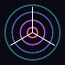

# Ghost Notes: A Spectral Experience

<p align="center"></p>

_Notes that perform: a note becomes a show, drawn from its sound and read in its own voice._

---

## description

Ghost Notes is a notes app made with [Godot](https://godotengine.org/) 4.7, in which a note becomes whatever is attached to it. With a song it is a spectral audio visualizer - procedural and deterministic, so the same song always draws the same show, with no generative model in the render path. With a script it is a reading, in a voice synthesized from first principles or a small local neural one; with a show's brief, a card reading made by AI agents - a tarot deck, for now; with a clip, a chroma-key effects editor. Any show exports to video. On a phone, it is a notes app and nothing more.

<details>

<summary>features</summary>

<!-- AUTODOC:FEATURES:BEGIN -->

Ghost Notes is built from registries. Each page below is generated from one, listing every entry and where it lives; [docs/index.md](docs/index.md) is the whole map.

- [Components and templates](docs/components.md) (13 components, 7 templates) - what a note can carry, the templates **New** makes from it, and what each part asks of the platform.
- [Scenes](docs/scenes.md) (55) - the visualizer scenes in the rotation, each from its own doc comment.
- [Media](docs/media.md) (7) - what the show is carried on.
- [Look filters](docs/filters.md) (8) - the post-process over the whole picture.
- [Layers](docs/layers.md) (22) - the visual components scenes compose - weather, skies, atmosphere.
- [Forces](docs/forces.md) (8) - the physics primitives particles compose.
- [Stage actors and verbs](docs/stage.md) (3 actors, 22 verbs) - what a storyboard's `stage` entries are made of.
- [Masking effects](docs/masking.md) (21) - the video effects editor: its model, its effects and its headless tools.
- [Script marks](docs/script.md) (29) - every mark a script may carry - the script editor's palette.

<!-- AUTODOC:FEATURES:END -->

</details>

<details>

<summary>subsystems</summary>

<!-- AUTODOC:SUBSYSTEMS:BEGIN -->

Documented outside the registry pages.

- [How the show is made](docs/architecture.md) - from the audio to the screen or a video file: the signal path, composition, drawing, scheduling, rendering - and adding a scene.
- [The environment](docs/environment.md) - what Ghost Notes installs itself, and the few programs that stay the machine's.
- [CLI flags](docs/cli.md) - every command-line flag.
- [Storyboards](storyboards/README.md) - the data spec Manual notes are written in.

<!-- AUTODOC:SUBSYSTEMS:END -->

</details>

<details>

<summary>layout</summary>

<!-- AUTODOC:LAYOUT:BEGIN -->

Top-level layout; every script is in [docs/index.md](docs/index.md).

- **[`project.godot`](project.godot)** - Godot 4.7 project; autoloads `Settings`, `Boot`, `Spectrum`, `Director`, `Provisioner`; `scenes/main.tscn` is the entry scene.
- **[`scenes/`](scenes/)** - The Godot entry scene (`main.tscn`). Everything else is code-built.
- **[`src/`](src/)** - All GDScript. Per-script map in [docs/index.md](docs/index.md); the subsystem groups are described there too.
- **[`src/scenes/`](src/scenes/)** - The visualizer scene catalog - one class per scene. See [docs/scenes.md](docs/scenes.md).
- **[`src/media/`](src/media/)** - The media - what the show is carried on. See [docs/media.md](docs/media.md).
- **[`shaders/`](shaders/)** - The GPU shaders: the Look, every Masking effect, the card table and a few scenes.
- **[`storyboards/`](storyboards/)** - Manual-mode scene scores (YAML; JSON accepted). [storyboards/README.md](storyboards/README.md) is the data spec.
- **[`data/`](data/)** - Data the code reads - pronunciation (CMUdict, `english.yml`), the LibriTTS speaker table, the decks (the tarot's meanings) - each license beside its file.
- **[`fonts/`](fonts/)** - Faces the media draw with: the notebook's handwriting and the card table's lettering.
- **[`hosts/`](hosts/)** - The Python hosts ghost spawns, each in an environment of its own the Provisioner builds (`src/deps.gd`): `voice/` the neural voice, `face/` Masking's face and body pre-passes, `capture/` the tablet's page capture. Kept out of the exported .pck.
- **[`scripts/`](scripts/)** - Build and check scripts: `scripts/check.sh` runs every gate (`--gpu` adds the ones that need a real renderer), `scripts/build.sh` exports a target into `dist/`.
- **[`tests/`](tests/)** - The gates (`*_check.gd`), probes (`*_probe.gd`) and their runners; `scripts/check.sh` runs them all.
- **[`docs/`](docs/)** - Generated documentation. Regenerate with `python docs.py`; do not edit by hand.
- **[`next/`](next/)** - Design notes and plans, one per subsystem: [notes.md](next/notes.md) is the notes refactor, step by step, and [roadmap.md](next/roadmap.md) is what comes next.
- **[`reference/`](reference/)** - Reference imagery scenes were prototyped from.
- **`masks/`** - Saved Masking sessions, one directory per source video (runtime, git-ignored).
- **`feedback/`** - Feedback console output: `NNNN.json` + `NNNN.png` per report (runtime, git-ignored).
- **`dist/`** - Build artifacts and the gates' logs (runtime, git-ignored).
- **`audio/`** - Drop a `song.wav` here to bundle one (runtime, git-ignored); or use `--audio`.

<!-- AUTODOC:LAYOUT:END -->

</details>

<details>

<summary>installation and usage</summary>

## running it

Godot 4.7 is the only thing to install; Ghost Notes fetches the rest itself ([the environment](docs/environment.md)). Open `project.godot` and press play, or:

```
godot --path .                          # the notes list
godot --path . -- --note chapter.md     # open one note
godot --path . -- --audio ~/track.wav   # straight into a song
```

Every flag is in [docs/cli.md](docs/cli.md). Keys: `Space` play/pause, `N` next scene, `F11` full screen, `` ` `` feedback, `Esc` quit.

## building and testing

```
scripts/check.sh                       # every gate (--gpu adds the ones that need a real renderer)
scripts/build.sh                       # the gates, then every target exported into dist/
scripts/build.sh --install android     # the phone build, onto a connected phone
python docs.py                         # regenerate docs/ and this README's lists
```

What comes next is [next/roadmap.md](next/roadmap.md).

</details>
